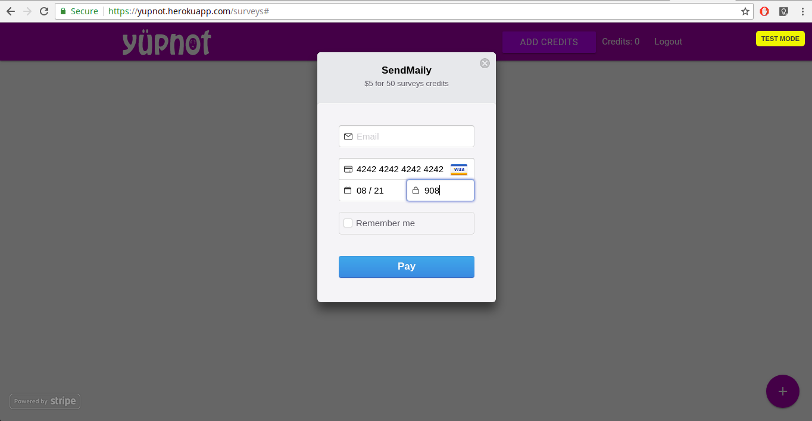
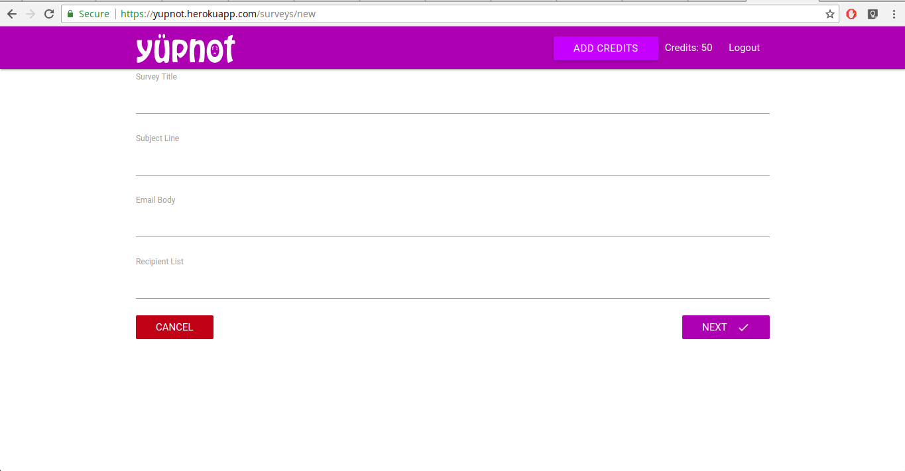
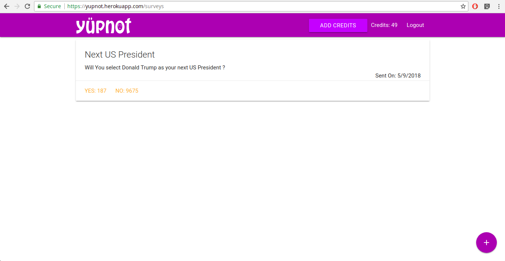

## yupnot

https://yupnot.herokuapp.com

### A Fullstack application written using node.js, express.js, react.js, mongodb.

Basic Functionality - Simple create a survey of getting a user response of yes and no
from your user.

To test the application login with google, and make payment, DON'T use real credit card.
Stripe is in test mode use card number 4242 4242 4242 4242 and put any CVC number and future
validity date.

and start sending your survey

Some example image

